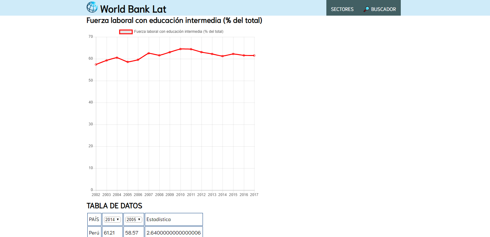

# World Bank Lat 
***
## Índice

* [Proyecto](#proyecto)
* [Definición del Producto](#temática-Elegida)
* [Usuarios](#principales-usuarios)
* [Historias de Usuario](#historias-de-usuario)
* [Desarrolo del Proyecto](#desarrollo-del-proyecto)

## Proyecto

"WORLDBANK Base de Datos" contiene las estadísticas nacionales e internacionales, de los indicadores de desarrollo.

WORLDBANK  consta de 139 indicadores por pais, asi como cada indicador cuenta con la data de las estadisticas correspondiente al rango de años desde 1960 a 2017; Permite al usuario poder acceder a esta información de manera directa, sencilla y detallada. El usuario puede:

Filtrar la data (búsqueda rápida, busqueda por temas y búsqueda por años).

Ordenar la data (Ascendente o Descendente)

Promediar las estadisticas de la totalidad de años.

El enfoque para las soluciones a los problemas de los usuarios, se preciso con los objetivos, de que sea muy sencillo de entender, de fácil manipulación, con acceso rápido y directo, y que la definicón de terminado abarque las soluciones al usuario.

Se implementaron todas las definiciones de terminado a WORLDBANK Base de Datos, por consiguiente, las soluciones a los problemas del usuario.

## Principales Usuarios

El primer paso que se realizo fue investigar sobre nuestros posibles usuarios y definirlos, en su mayoria estudiantes (universitarios, de maestria,etc.); asi también, se les consultó cuales son los problemas que encuentran con las bases de datos que usan con mas frecuencias. Posteriormente se realizo el análisis de los resultados de la investigaciones, recolectando información por medio de encuestas. A partir de ello, definimos las posibles soluciones a los problemas de nuestros usuarios, las historias de usuario y su definición de terminado.

## Historias de Usuario

HISTORIA 1: Yo como usuario quiero visualizar los indicadores por sectores para poder elegir la información mas relevante para mi.
> Definición de terminado : Se muestra un selector con el nombre de los Sectores a 
 elegir. Indicadores mostrados y clasificados según el sector que elijan, Pasa testeo de usabilidad.

HISTORIA 2: Yo como usuario deseo filtrar la data por países  para una mejor visualización.
> Definición de terminado : Se visualiza un selector con los 4 paises. Se muestra como predeterminado a Perú. Pasa testeo de usabilidad.

HISTORIA 3: Yo como usuario quiero tener un buscador para una búsqueda mas fácil de los indicadores relacionados y obtener a los indicadores ordenados en orden asc. o desc.
> Definición de terminado : Se obtiene una caja de texto donde se pueda insertar una palabra o frase que filtre y muestre a los indicadores en una lista. Se muestran 2 opciones para ordenar los indicadores ( asc. y desc.). Pasa testeo de usabilidad.

HISTORIA 4: Yo como usuario quiero ver los datos en un gráfico para poder visualizar el ascenso o descenso de los años.
> Definición de terminado : Se visualiza el gráfico del indicador y país elegido, por   años y en %. Pasa testeo de usabilidad. Responsive.

HISTORIA 5:  Yo como usuario quiero poder observar una tabla con la data por años para tener una mejor comparación.
> Definición de terminado : Se visualiza una tabla donde se visualiza el 
 nombre del país y dos rangos de años, en cada casilla por medio de flechitas se podrá subir o bajar la cantidad del año, para así poder comparar el crecimiento o descenso entre esos 2 años. Pasa testeo de usabilidad. Responsive.

## Solución al problema y necesidades del Usuario

Después de conocer a los principales usuarios y entender sus necesidades, se llegó a la decisión de construir una interfaz web que permita visualizar y manipular data,aplicando asi todas las historias de usuario que logramos recopilar gracias a los testeos y encuestas; de esta manera se resolvería en gran manera las necesidades del usuario.

## Desarrollo del Proyecto

### *PRIMER SPRINT*

1)Organizacion y manejo del proyecto mediante un tablero.

2) Sketch de la 1era solución (prototipo de baja fidelidad).

3) Resultados del primer Sprint
- Historias de usuario claras y concisas.
- HTML 5 basico.
- Funcion y testeo del Filtrado.

#### Testeos de usabilidad

- Al usuario le gusto mucho el prototipo, pero les encantaria tener una busqueda rápida (se añadió un buscador a las historias de usuario).

- Al usuario le gustaria una pantalla de inicio de presentación.

- Al usurario le gustaria ver el menu con letra mas grande.

### *SEGUNDO SPRINT*

1) Se cambió la oganización del proyecto con la creación de un Proyect en Git Hub

2)Trabajamos un segundo prototipado de baja fidelidad.

2.1) Se manejo un prototipo Responsive.

3) Resultados del segundo Sprint
- Se tiene ya el buscador (pasa testeo de usabilidad).
- Se tiene la pagina de filtrar por paises y sectores mostrando los indicadores (pasa testeo de usabilidad).
- HTML 5 basico.
- Funcion y testeo del ordenado, cambio de la función de filtrado.
- Se obtiene la tabla con los datos por años.

#### Testeos de usabilidad

- Al usuario le gusto la manera ordenada en que se muestra a los indicadores y lo fácil que es usar el buscador. 
- Al usuario le gustaria que en la barra de menu este el acceso mas facil hacia el buscador.
- El usuario quiere que se cambie la imagen de fondo pues lo distrae mucho de la visualizacion de los datos.
- Al usuario le gustaria poder filtrar por paises y encontrar los indicadores facilmente.
- Al usuario le gustaria poder encontrar el promedio por todos los años.

### *TERCER SPRINT*

1) Sketch del tercer sprint (prototipo de alta fidelidad).

Después de aprobar el testeo de usabilidad se realizó en diseño final, que se buscó implementar en este proyecto.

2)Resultado del tercer sprint

AGREGAMOS PANTALLA DE BIENVENIDA

INCORPORAMOS UN GRAFICO CON CHART.JS POR CADA INDICADOR.

#### Testeos de usabilidad

- Al usuario le gusto mucho poder encontrar un listado de indicadores relacionados al lado del grafico
- Al usuario le hubiese gustado poder comparar los 4 paises a la vez.
